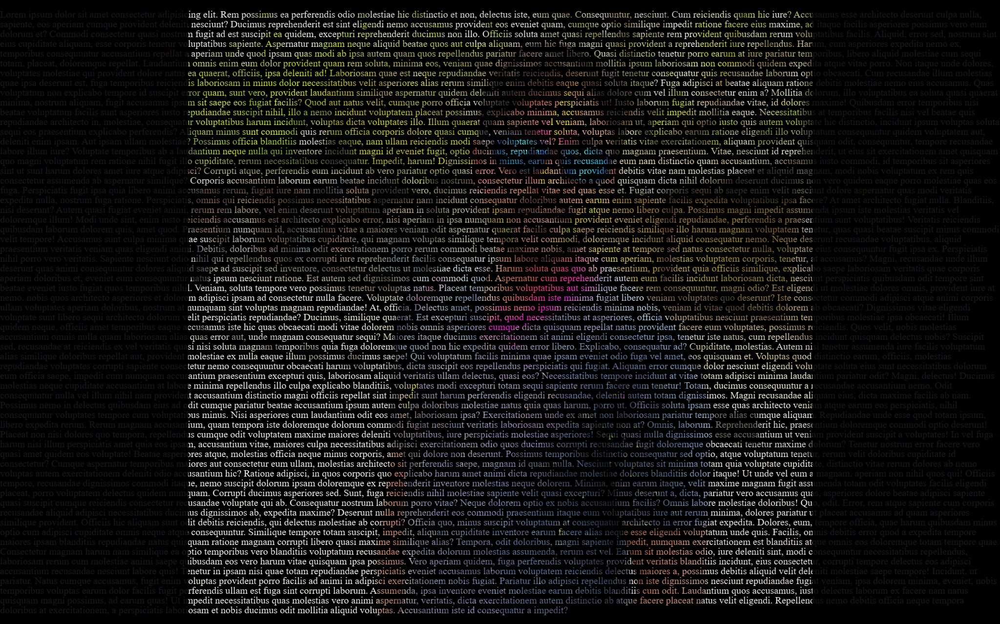
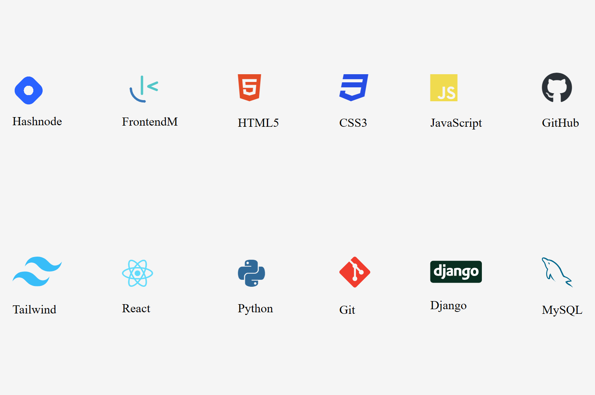
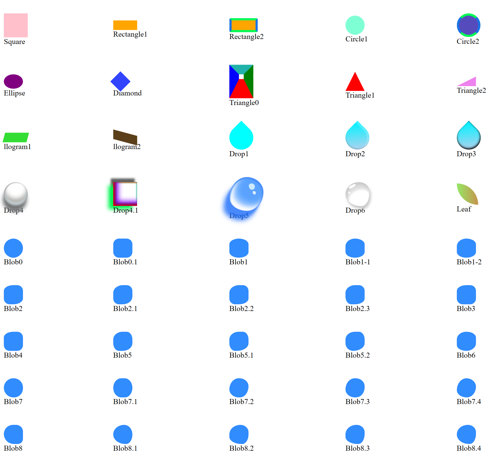

# CSS ART

This repository contain various types of CSS art. It is combinations of my designs and inspirations I got from other designs.

## Table of contents

- [Overview](#overview)
  - [Snapshots](#snapshots)
  - [Links](#links)
- [My process](#my-process)
  - [Built with](#built-with)
  - [Useful resources](#useful-resources)
- [Author](#author)

## Overview

Some designs are from other people. Sometimes I add or remove, sometimes as it is from the design. As it is hard to know the original owner of design in most cases so I did not tag people. But I did not any claim ownership. I use them to learn.

So, _No copyright infringement intended_ for those designs.

### Snapshots

See snapshots of some of the designs-

**Alphabets:** Use alphabets on an image

**Logos:** Different icons of tech stack in one file. All are hoverable.

**Shapes:** Geometry is all around. Blob is a new entry.

### Links

| Project Name      | Source Code                                                               | Live Link                                                                    |
| ----------------- | ------------------------------------------------------------------------- | ---------------------------------------------------------------------------- |
| Alphabets         | [Code](https://github.com/SoniBasant/CSS-ART/tree/main/Alphabats)         | [Live](https://sonibasant.github.io/CSS-ART/Alphabats/alpha.html)            |
| Background        | [Code](https://github.com/SoniBasant/CSS-ART/tree/main/Background)        | [Live](https://sonibasant.github.io/CSS-ART/Background/FM1.html)             |
| Characters        | [Code](https://github.com/SoniBasant/CSS-ART/tree/main/Characters)        | [Live](https://sonibasant.github.io/CSS-ART/Characters/Phineas.html)         |
| Logos             | [Code](https://github.com/SoniBasant/CSS-ART/tree/main/Logos)             | [Live](https://sonibasant.github.io/CSS-ART/Logos/logo.html)                 |
| Pattern-Polka-Dot | [Code](https://github.com/SoniBasant/CSS-ART/tree/main/Pattern-Polka-Dot) | [Live](https://sonibasant.github.io/CSS-ART/Pattern-Polka-Dot/polkaDot.html) |
| Pattern-Squares   | [Code](https://github.com/SoniBasant/CSS-ART/tree/main/Pattern-Squares)   | [Live](https://sonibasant.github.io/CSS-ART/Pattern-Squares/square.html)     |
| Shapes            | [Code](https://github.com/SoniBasant/CSS-ART/tree/main/Shapes)            | [Live](https://sonibasant.github.io/CSS-ART/Shapes/shapes.html)              |
| Waves-in-circle   | [Code](https://github.com/SoniBasant/CSS-ART/tree/main/Waves-in-circle)   | [Live](https://sonibasant.github.io/CSS-ART/Waves-in-circle/waveCircle.html) |

## My process

### Built with

- HTML

- Vanilla CSS
- Icons
- svg images

### Useful resources

- [freecodecamp](https://www.freecodecamp.org/) - All the problems I solved. Helped me a lot. 🙌

- [w3schools](https://www.w3schools.com) - This helped me throughout my journey. Still doing. 🙂
- [cdnjs](https://cdnjs.com/libraries/font-awesome) - For Icons and fonts

## Author

Basant Soni 👨‍💻

- GitHub - [@SoniBasant](https://github.com/SoniBasant)

- Frontend Mentor - [@SoniBasant](https://www.frontendmentor.io/profile/SoniBasant)
- CodePen - [@SoniBasant](https://codepen.io/sonibasant)
- Hashnode - [@SoniBasant](https://sonibasant.hashnode.dev/)
